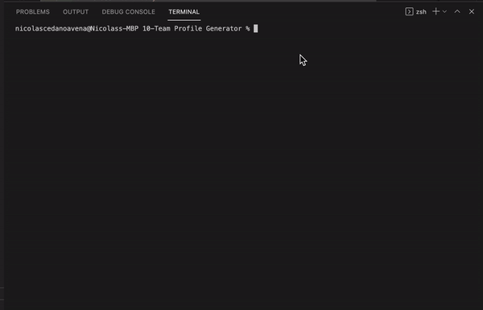
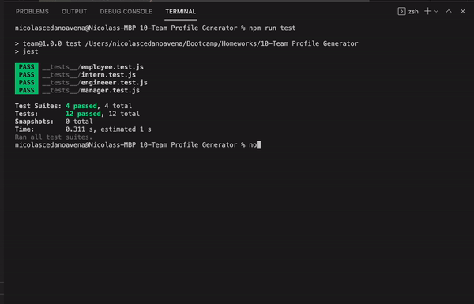
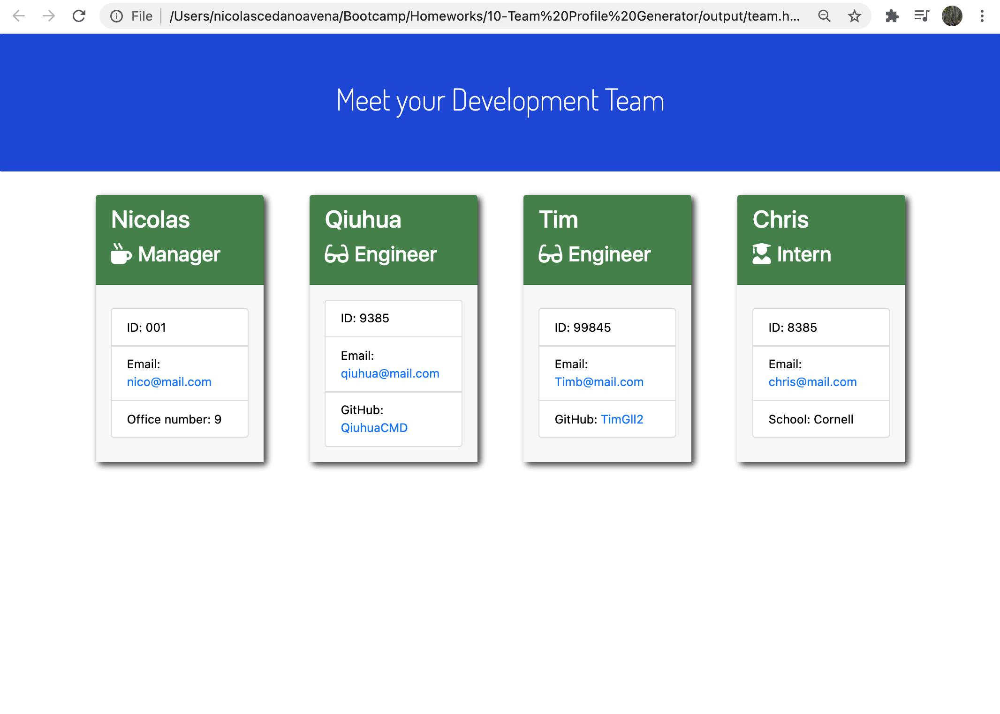

# 10 - OOP: Team Profile Generator

## Project 

This project consists on a Node.js command-line application that takes in information about employees on a software engineering team, then generates an HTML webpage that displays summaries for each person. Testing is key to making code maintainable, so ther is also a unit test for every part of your code.


## Table of Contents

- [Installation](#Installation)
- [Usage](#Usage)
- [UserStory](#UserStory)
- [AcceptanceCriteria](#AcceptanceCriteria)
- [Screenshots](#Screenshots&Test)
- [Demo](#Demo)


## Installation

Install all the dependencies that are on the package.json 

```bash
npm install
```


## Usage

To run the application use node

```bash 
node index.js
```


## User Story

```md
AS A manager
I WANT to generate a webpage that displays my team's basic info
SO THAT I have quick access to their emails and GitHub profiles
```


## Acceptance Criteria

```md
GIVEN a command-line application that accepts user input
WHEN I am prompted for my team members and their information
THEN an HTML file is generated that displays a nicely formatted team roster based on user input
WHEN I click on an email address in the HTML
THEN my default email program opens and populates the TO field of the email with the address
WHEN I click on the GitHub username
THEN that GitHub profile opens in a new tab
WHEN I start the application
THEN I am prompted to enter the team manager’s name, employee ID, email address, and office number
WHEN I enter the team manager’s name, employee ID, email address, and office number
THEN I am presented with a menu with the option to add an engineer or an intern or to finish building my team
WHEN I select the engineer option
THEN I am prompted to enter the engineer’s name, ID, email, and GitHub username, and I am taken back to the menu
WHEN I select the intern option
THEN I am prompted to enter the intern’s name, ID, email, and school, and I am taken back to the menu
WHEN I decide to finish building my team
THEN I exit the application, and the HTML is generated
```


## Screenshots & Test
The following gifs and images show the application appearance:








  
## Demo URL 

The following link takes you to a video with the app demo:
URL: https://drive.google.com/file/d/1w0guKYPV2DTKYcz_-aAi7Fk1jhcsN2OD/view?usp=sharing


## Used Frameworks/Technologies

- Inquirer
- Node.js
- Jest
- JavaScript
- OOP


### Contributor


Nicolas Cedano Avena
- - -
© 2021 Trilogy Education Services, LLC, a 2U, Inc. brand. Confidential and Proprietary. All Rights Reserved.